**Ditujukan kepada**

- *Approver User*

**Role yang sesuai**

- Sekretaris

SPPTH dibuat oleh konseptor/sekretaris Direksi yang akan meninggalkan tempat, sedangkan *approver* adalah Direktur Utama atau Pjs. Direktur Utama. Langkah - langkah untuk menambah SPPTH adalah sebagai berikut

1. Klik menu **New Correspondence**

2. Pilih jenis surat "**SPPTH**"

3. Isi *form* tambah SPPTH. Terdapat beberapa aksi untuk menindaklanjuti SPPTH yang sudah diisi *form*nya yaitu **Simpan SPPTH** dan **Kirim SPPTH.**

####  **Simpan SPPTH**

Langkah - langkah untuk menyimpan SPPTH adalah sebagai berikut.

1. Isi *form* SPPTH kemudian klik **Simpan**

2. Sistem akan menampilkan tampilan *preview* SPPTH dalam bentuk Word yang dapat di edit. Untuk melakukan *editing* terhadap isi surat klik **Ubah Isi** kemudian sistem akan menampilkan *pop up* konfirmasi **Ubah Word Desktop** atau **Ubah Online**

#### **[Edit] Word Desktop**

Langkah - langkah untuk mengubah isi SPPTH melalui Word Desktop adalah sebagai berikut.

1. Klik **Ubah di Word** untuk mengubah melalui aplikasi Microsoft Word

2. Lakukan perubahan pada isi surat. Klik **Close** pada aplikasi dan isi surat akan otomatis tersimpan

#### **[Edit] Ubah Online**

Langkah - langkah untuk mengubah isi SPPTH secara online adalah sebagai berikut.

1. Klik **Ubah Online** untuk mengubah isi surat secara online

2. Lakukan perubahan pada isi surat. Klik **Close** pada aplikasi

3. Isi surat akan otomatis tersimpan. Jika surat akan disimpan sebagai draft, maka klik **Tutup.**

4. Surat yang sudah selesai diubah maka akan tersimpan di menu "**Draft - SPPTH**"

#### **Kirim SPPTH**

Langkah - langkah untuk mengirim SPPTH adalah sebagai berikut.

1. Pada tampilan *preview* SPPTH, klik **Kirim** untuk mengirim SPPTH ke *approver*

2. Sistem menyimpan perubahan dan SPPTH akan tersimpan di menu "**Outbox - SPPTH**"

## **P-Office Versi Teams**

Langkah - langkah untuk tambah SPPTH via Teams yaitu :

1.  Klik menu **New Correspondence**

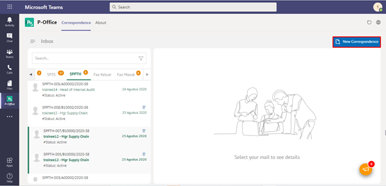

2.	Pilih jenis surat “**SPPTH**”

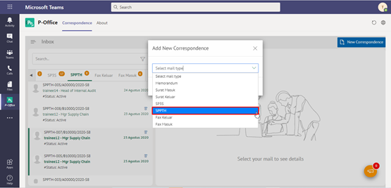

3.	Isi form tambah SPPTH. Terdapat beberapa aksi untuk menindaklanjuti SPPTH yang sudah diisi formnya yaitu **Save SPPTH** dan **Cancel SPPTH.**

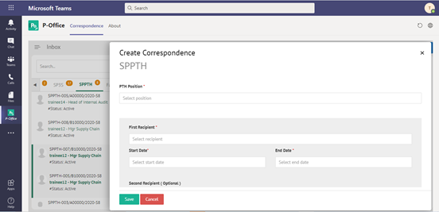

#### **Simpan SPPTH**

Langkah – langkah untuk menyimpan SPPTH adalah sebagai berikut.

1.	Isi form SPPTH kemudian klik **Save**

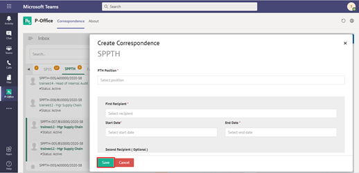

2.	Sistem akan menampilkan tampilan preview SPPTH dalam bentuk Word yang dapat di edit. Untuk melakukan editing terhadap isi surat klik **Edit Content** kemudian sistem akan menampilkan pop up konfirmasi **Ubah Word Desktop** atau **Ubah Online**

#### **[Edit] Word Desktop**

Langkah – langkah untuk mengubah isi SPPTH melalui Word Desktop adalah sebagai berikut.

1.    Klik **Open In Desktop App** untuk mengubah melalui aplikasi Microsoft Word

2.    Lakukan perubahan pada isi surat. Klik **Close** pada aplikasi dan isi surat akan otomatis tersimpan

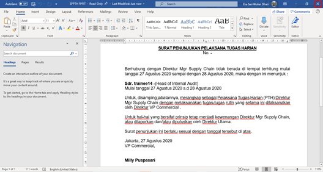

#### **[Edit] Ubah Online**

Langkah – langkah untuk mengubah isi SPPTH secara online adalah sebagai berikut.

1.    Ketika Klik button **Edit Content** maka secara otomatis akan membuka dokumen dan bisa mengubah isi surat secara online

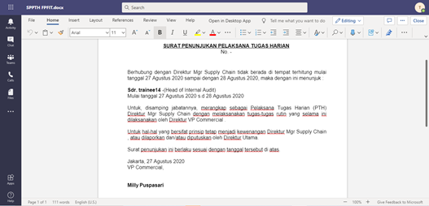

2.    Lakukan perubahan pada isi surat.

3.    Isi surat akan otomatis tersimpan. Jika surat akan disimpan sebagai draft, maka klik **Close** 

4.    Surat yang sudah selesai diubah maka akan tersimpan di menu **“Draft – SPPTH”**

#### **Kirim SPPTH**

Langkah – langkah untuk mengirim SPPTH adalah sebagai berikut.

1.	Pada tampilan preview SPPTH, klik **Send** untuk mengirim SPPTH ke approver

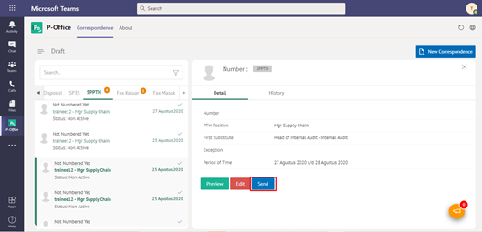

2. Sistem menyimpan perubahan dan SPPTH akan tersimpan di menu **“Outbox - SPPTH”**

## **P-Office Versi Android**

Langkah - langkah untuk tambah SPPTH via Android yaitu :

1. Klik ikon **(+)** pada SPPTH

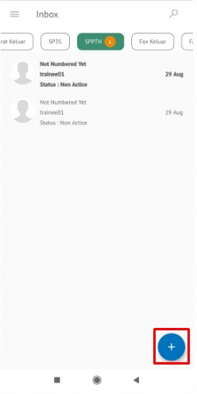

2. Pilih jenis surat “**SPPTH**”

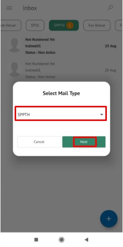

3. Isi _form_ tambah SPPTH. pilih **Save** terdapat aksi untuk menindaklanjuti SPPTH yang sudah diisi _form_ nya yaitu **Edit Content** dan **Send.**

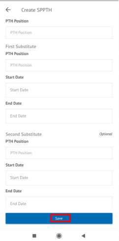 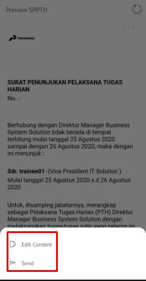

**Simpan SPPTH**

Langkah – langkah untuk menyimpan SPPTH adalah sebagai berikut.

1. Isi _form_ SPPTH kemudian klik **Save**

 

2. Sistem akan menampilkan tampilan _preview_ SPPTH dalam bentuk Word yang dapat di edit. Untuk melakukan _editing_ terhadap isi surat klik **Edit Content** kemudian sistem akan menampilkan **Word Online**

**[Edit] Ubah Online**

Langkah – langkah untuk mengubah isi SPPTH secara online adalah sebagai berikut.

1. Klik **Edit Content** untuk mengubah isi surat secara online

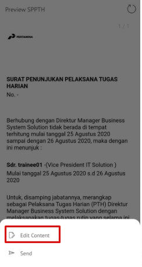 

2. Lakukan perubahan pada isi surat lalu sistem akan menampilkan pop up P-Office Editing Document pilih **Yes**

 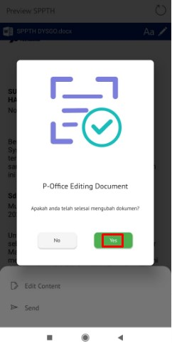

3. Isi surat akan otomatis tersimpan. Jika surat akan disimpan sebagai draft, maka klik **Close.**
    
 

4. Surat yang sudah selesai diubah maka akan tersimpan di menu “**Draft – SPPTH”**

**Kirim SPPTH**

Langkah – langkah untuk mengirim SPPTH adalah sebagai berikut.

1. Pada tampilan _preview_ SPPTH, klik **Kirim** untuk mengirim SPPTH ke _approver_

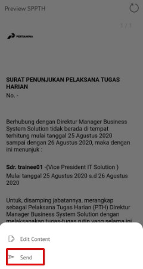

2. Sistem menyimpan perubahan dan SPPTH akan tersimpan di menu “**Outbox - SPPTH**”

