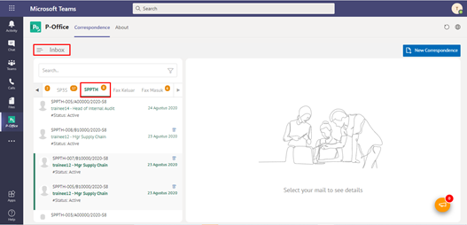

**Role yang sesuai**

- *Approver User*

*User* dapat menolak SPPTH yang sudah dikirimkan oleh konseptor. Langkah-langkah untuk menolak SPPTH adalah sebagai berikut

1. Klik menu **Inbox** dan pilih tab **SPPTH**

2. Pilih SPPTH yang akan disetujui kemudian pilih tab **Detail**

3. Klik tombol **Reject** dan pilih **Send.** Isikan komentar jika diperlukan

4.	Sistem berhasil menyimpan perubahan. SPPTH yang sudah di kirim akan akan akan terhapus dari aplikasi akan tersimpan di menu **“Rejected – Memorandum”** user penolak dengan label **Rejected**

## **P-Office Versi Teams**

Langkah - langkah untuk tolak SPPTH via Teams yaitu :

1.	Klik menu **Inbox** dan pilih tab **SPPTH**

 
2.	Pilih SPPTH yang akan disetujui kemudian pilih tab **Detail**

 
3.	Klik tombol **Reject** dan pilih **Send**. Isikan komentar jika diperlukan

4.	Sistem berhasil menyimpan perubahan. SPPTH yang sudah di kirim akan akan akan terhapus dari aplikasi akan tersimpan di menu **“Rejected – Memorandum”** user penolak dengan label **Rejected**