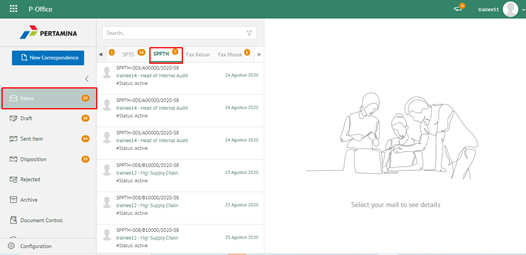
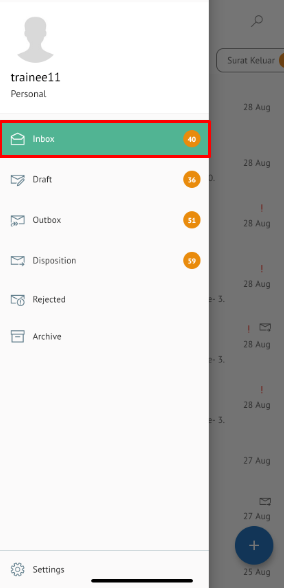

**Role yang sesuai**

- *Approver User*

*User* dapat menolak SPPTH yang sudah dikirimkan oleh konseptor. 

## **P-Office Versi Web**

Langkah-langkah untuk menolak SPPTH via web adalah sebagai berikut :

1. Klik menu **Inbox** dan pilih tab **SPPTH**

2. Pilih SPPTH yang akan disetujui kemudian pilih tab **Detail**

3. Klik tombol **Reject** dan pilih **Send.** Isikan komentar jika diperlukan

4.	Sistem berhasil menyimpan perubahan. SPPTH yang sudah di kirim akan akan akan terhapus dari aplikasi akan tersimpan di menu **“Rejected – SPPTH”** user penolak dengan label **Rejected**

## **P-Office Versi Teams**

Langkah - langkah untuk tolak SPPTH via Teams adalah sebagai berikut :

1.	Klik menu **Inbox** dan pilih tab **SPPTH**

 
2.	Pilih SPPTH yang akan disetujui kemudian pilih tab **Detail**

 
3.	Klik tombol **Reject** dan pilih **Send**. Isikan komentar jika diperlukan

4.	Sistem berhasil menyimpan perubahan. SPPTH yang sudah di kirim akan akan akan terhapus dari aplikasi akan tersimpan di menu **“Rejected – SPPTH”** user penolak dengan label **Rejected**

## **P-Office Versi Android**

Langkah - langkah untuk menolak SPPTH via Android adalah sebagai berikut :

1. Klik menu **Inbox** dan pilih tab **SPPTH**
   
 

2. Pilih SPPTH yang akan disetujui kemudian pilih icon **Option**

3. Pilih button lalu **Reject** kemudian sistem menampilkan pop up dan Isikan komentar jika diperlukan lalu pilih **Send.**

 

4. Sistem berhasil menyimpan perubahan. SPPTH yang sudah di kirim akan tersimpan dimenu “**Rejected- SPPTH”** user penolak pada label “**Rejected” **user penolak dengan label **Rejected**

## **P-Office Versi IOS**

Langkah - langkah untuk menolak SPPTH via IOS adalah sebagai berikut :

1.	Klik menu **Inbox** dan pilih tab **SPPTH**
  
 

2.	Pilih SPPTH yang akan disetujui kemudian pilih icon **Option** dan pilih **Reject**
  
 

3.	Isikan komentar jika diperlukan dan pilih **Send**
 

4.	Sistem berhasil menyimpan perubahan. SPPTH yang sudah di tolak akan tersimpan dimenu **“Rejected– SPPTH” **user penolak dengan label **Rejected**
