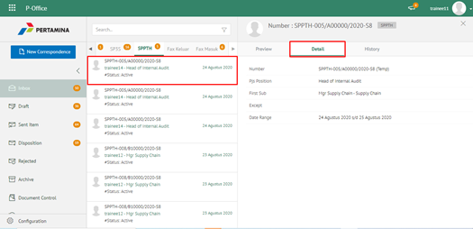
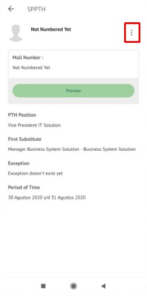
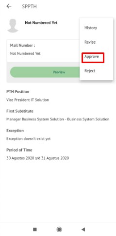
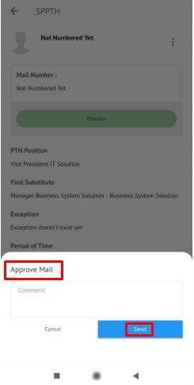

**Role yang sesuai**

- *Approver User*

*User* dapat menyetujui SPPTH yang sudah dikirimkan oleh konseptor sehingga nomor SPPTH akan ter-*generate* secara otomatis. Langkah - langkah untuk menyetujui SPPTH adalah sebagai berikut

1. Klik menu **Inbox** dan pilih tab **SPPTH**

2. Pilih SPPTH yang akan disetujui kemudian pilih tab **Detail**

3. Klik tombol **Approve** dan pilih **Send.** Isikan komentar jika diperlukan

4. Sistem berhasil menyimpan perubahan. SPPTH yang sudah di kirim akan tersimpan di menu **Outbox - SPPTH**

## **P-Office Versi Teams**

Langkah - langkah untuk setujui SPPTH via Teams yaitu :

1.	Klik menu **Inbox** dan pilih tab **SPPTH**

 
2.	Pilih SPPTH yang akan disetujui kemudian pilih tab **Detail**

 
3.	Klik tombol **Approve** dan pilih **Send**. Isikan komentar jika diperlukan

4.	Sistem berhasil menyimpan perubahan. SPPTH yang sudah di kirim akan tersimpan di menu Outbox – SPPTH

## **P-Office Versi Android**

Langkah - langkah untuk setujui SPPTH via Android yaitu :

1. Klik menu **Inbox** dan pilih tab **SPPTH**
   
 

1. Pilih SPPTH yang akan disetujui kemudian pada tab **Detail** pilih ikon **button**

3. Klik tombol **Approve** kemudian sistem menampilkan pop up dan isikan komentar jika di perlukan lalu pilih **Send.**

 

4. Sistem berhasil menyimpan perubahan. SPPTH yang sudah di kirim akan tersimpan di menu **Outbox – SPPTH**

## **P-Office Versi IOS**

Langkah - langkah untuk setujui SPPTH via IOS yaitu :