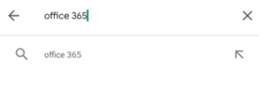
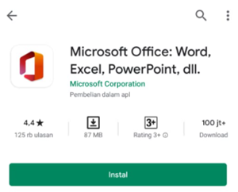
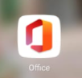
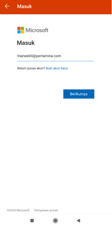
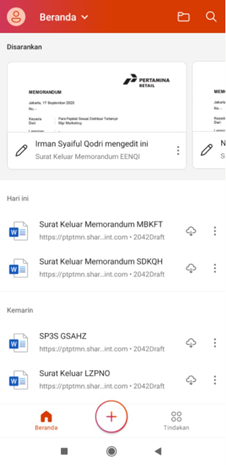

Pada bagian ini akan dijelaskan mengenai spesifikasi minimum perangkat lunak  yang diperlukan saat Anda mengakses aplikasi P-Office versi Android

**Perangkat Lunak**

1.	Gunakan operating system dengan spesifikasi minimum aplikasi P-Office yaitu Android SDK 17 (Android 4.2, Jelly Bean MR1) untuk mengakses aplikasi P-Office dengan hasil yang maksimal
2.	Gunakan editor pendukung aplikasi P-Office dengan menungunduh Microsoft Office. Berikut langkah-langkah untuk mengunduh Microsoft Office pada android yaitu:

-	Buka **Google Play**, lalu ketikkan Office 365

 
-	Pilih **Install** untuk menginstall aplikasi

 
-	Aplikasi yang sudah di install akan tampil pada pada perangkat Anda

 
-	Buka aplikasi Office 365 masukkan akun anda lalu pilih **Berikutnya**

 
-	Kemudian aplikasi tersebut akan menampilkan halaman beranda sesuai dengan akun P-Office Anda
 
