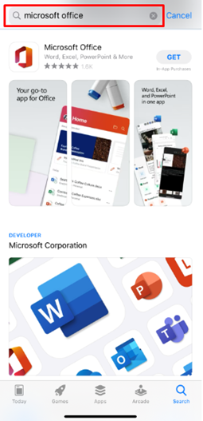
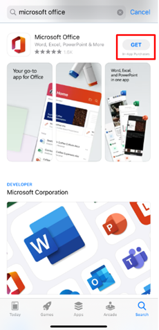
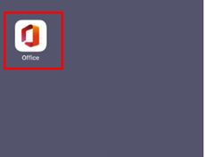
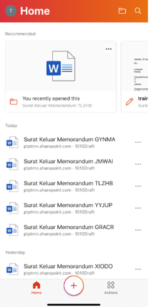

1. Gunakan operating system dengan spesifikasi minimum yaitu Operating System iOS 10 untuk mengakses aplikasi P-Office dengan hasil yang maksimal
2. Gunakan editor pendukung aplikasi P-Office dengan menungunduh Microsoft Office. Berikut langkah-langkah untuk mengunduh Microsoft Office pada iOS yaitu:

    * Buka **App Store** dan ketikkan Microsoft Office

        

    * Pilih **Get** untuk menginstal aplikasi

    

    * Aplikasi yang sudah di install akan tampil pada pada perangkat Anda

    

    * Buka aplikasi Office 365 masukkan akun anda lalu pilih **Next**
 
    

    * Kemudian aplikasi tersebut akan menampilkan halaman beranda sesuai dengan akun P-Office Anda

    

